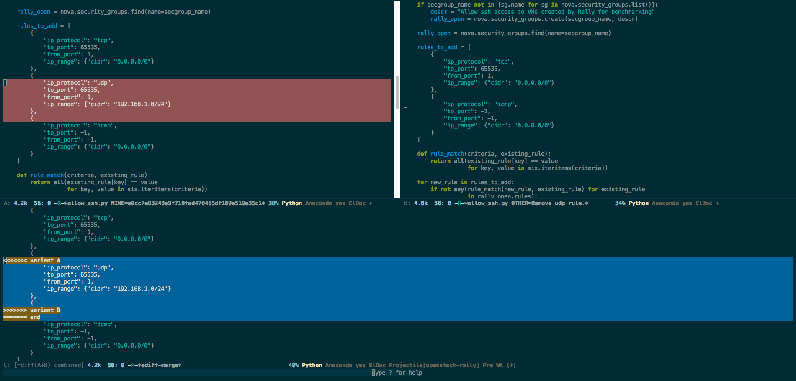

<h2>Table of Contents</h2>

<ul>
<li><a href="#orgheadline1">Resolving Merge Conflicts with Magit</a></li>
</ul>

# Resolving Merge Conflicts with Magit

I have been using magit for quite a while with my Emacs setup. Its a great
tool to have in your pocket if you are an Emacs user. It is basically an
Emacs frontend for git which exposes most of the git commands over a friendly
Emacs UI.

One of the nice things with magit is that it uses quite a bit of underlying
Emacs functionality which makes it even more powerful. Doing feature branches
is not my favorite thing to do, but if you are working in a distributed team
which uses feature branching and merging to trunk as stories get completed,
its easy to run into merge conflicts from time to time. I have found Magit to
be a very friendly tool to resolve merge conflicts. The best part
is that you do not have to leave Emacs at all for any part of the conflict
resolution process.

I will provide an example here. Suppose you are working on a branch called
`feature` and you want to pull in latest changes from `master`. One way you
can do that with magit is by checking out `master`, pull latest changes, come
back to your branch and rebase onto `master`. (Note that you can also use merge
instead of rebase, just two different techniques). Here's how you would do it
with magit.

    C-x g # open magit buffer
    b # open branch popup
    b # checkout branch

    # type master in the checkout interactive buffer
    F # open pull popup
    u # pull, rebase (if that action is set as the branch default)

After pulling latest changes on the master branch, you would like to get those
changes on your feature branch. To do this, we will checkout our branch
and rebase it onto master. This can be easily done with magit. Here's how we
will go about doing this.

    C-x g # open magit bufer
    r # open rebase popup
    e # selects a branch to rebase onto

    # type master on the interactive mini buffer to rebase onto master

If there are no conflicts, then this operation will finish without any issues
but if there is a conflict, magit will show the conflict in the magit buffer.

To resolve the conflicts, just move the cursor to the unmerged file in
*Unstaged* changes and press `e`. This will open a ediff merge window with
changes from both branches side by side and the resulting file at the bottom.
You can select either the left or the right change by pressing `a` or `b` and
can even go to the resulting buffer and make manual changes. Hit `n` to go to
the next conflict.

After resolving all conflicts in the current file, hit
`q` to exit the ediff session and press `s` to mark the conflict as resolved.
Repeat the same procedure for other conflicting files. After all conflicting
changes have been resolved, its time to continue the rebase. This can be
done by hitting `r` while in the magit buffer which will open the rebase popup
and `r` again to continue the rebase.
